# Pratikum5

| Nama  | Kelas | NIM   | Matkul |
|Fikhrul| TI.22.A.2 | 312210062 | Bahasa Pemograman|

## Latihan 1

-Tulis Code program seperti ini:
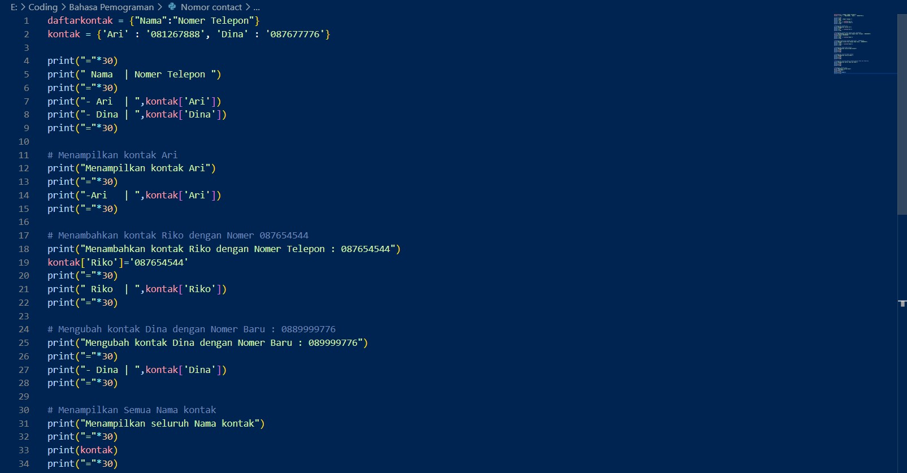
-Maka Ouput yang akan keluar seperti berikut:
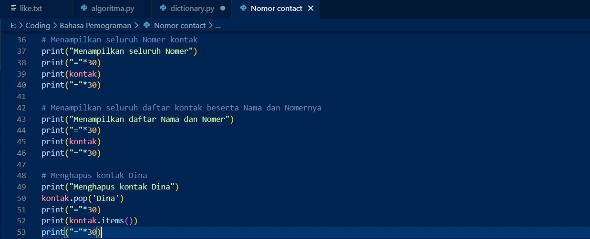

## Tugas Pratikum 5

# Penjelasan

1. Buat Dictionary kosong yang ingin dimasukkan data:
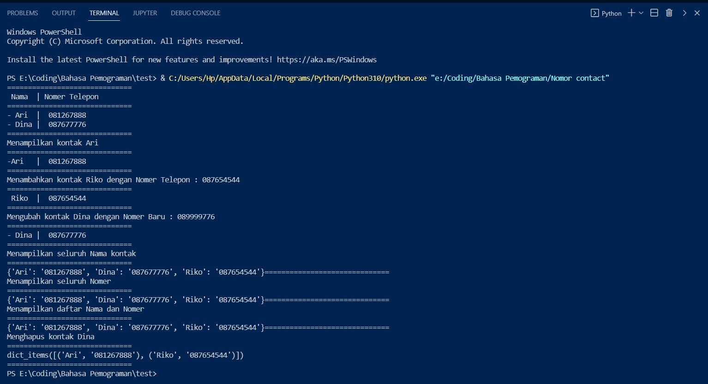
2. Buat perulangan kode dengan menggunakan while:

3. Tambahkan data yang ingin diinput seperti : NIM, Nama, Nilai tugas, NIlai UTS dan UAS. Maka data yang sudah diinput secara otomatis akan dimasukkan kedalam Dictionary:
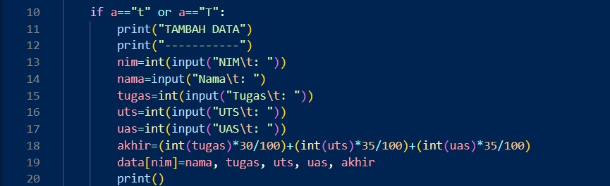
3. Data akan ditampilkan jika sudah diinput, akan akan TIDAK ADA jika belum diinputkan:
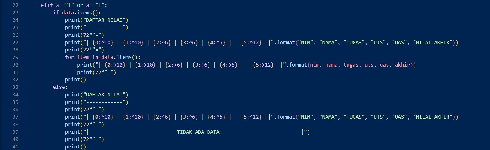
4. Apabila Anda ingin mengubah data, maka akan diminta kembali untuk menginputkan NIM yang telah ditulis, maka data akan terlihat:
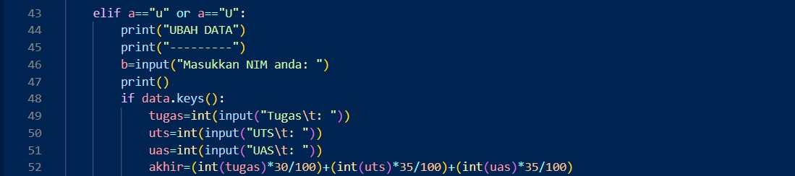
5. Jika ingin menghapus Data maka Anda akan dimitai kembali untuk menginputkan NIM, nilai tugas, UTS, dan UAS:
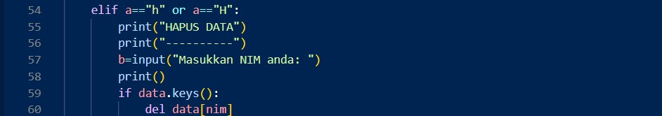
6. Dan jika Anda ingin mencari Data Anda,, maka Anda akan dimintai kembali untuk menuliskan NIM anda:
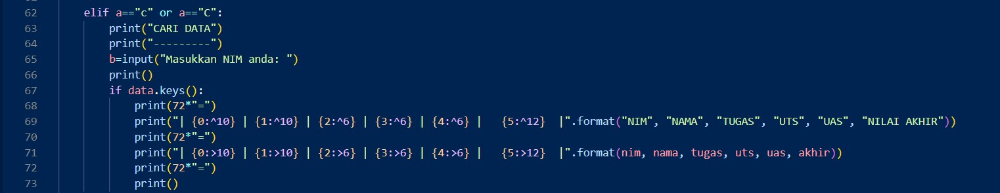
7. Jika sudah selesai, Maka Anda cukup memilih ("k"/"k"), untuk keluar:
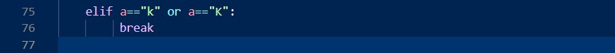

# Ouput

-Maka hasil Ouputnya sebagai Berikut:
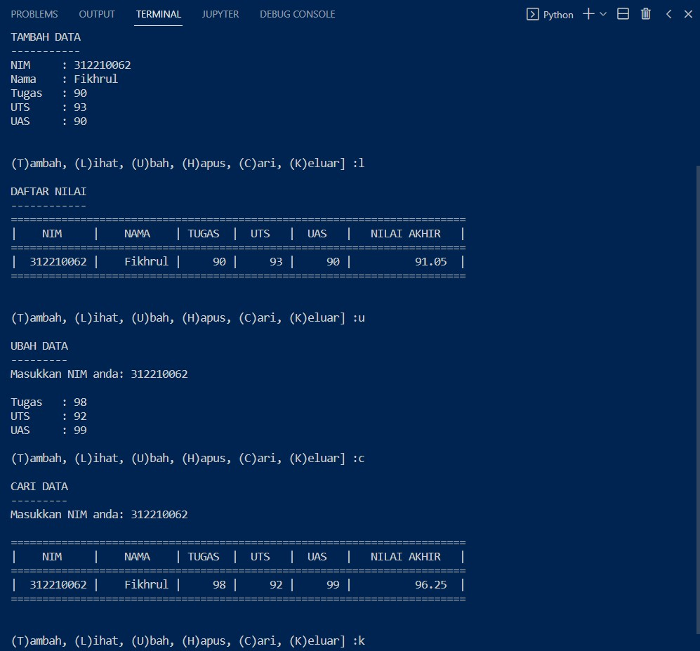

## Flowchat
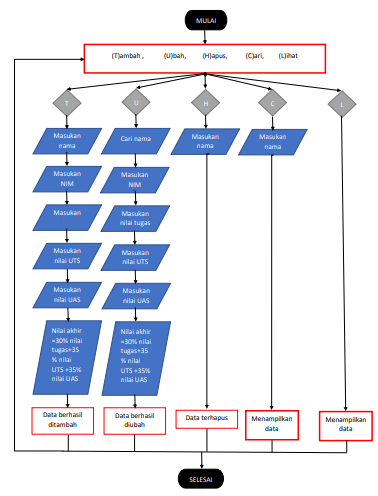

